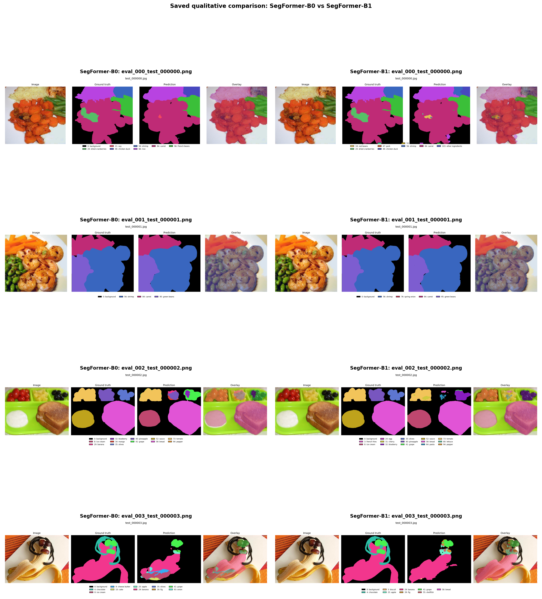
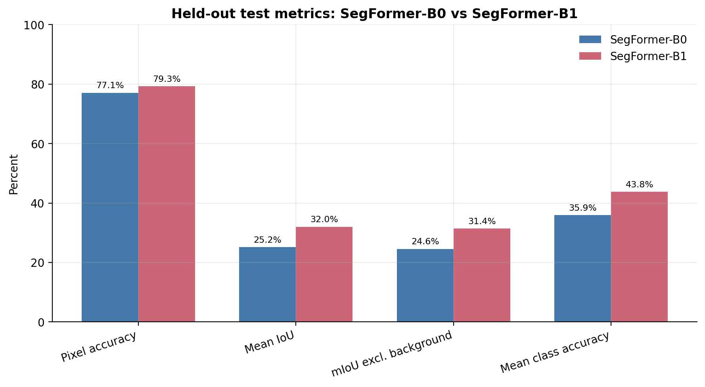
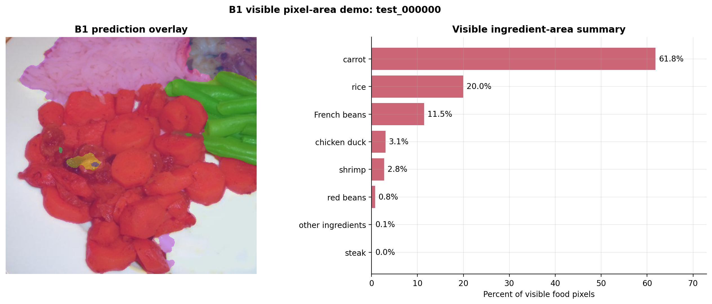

# FoodSeg103 Ingredient Segmentation with SegFormer

Fine-tuning and evaluating **SegFormer-B0** and **SegFormer-B1** for ingredient-level semantic segmentation on **FoodSeg103**.

The project predicts a class for each image pixel, compares the two SegFormer variants under the same training setup, analyzes per-class performance and failure cases, and converts predicted masks into **visible ingredient-area summaries**. SegFormer-B1 is the final selected model.

[Paper (arXiv)](https://arxiv.org/abs/2606.24059) · [DOI](https://doi.org/10.48550/arXiv.2606.24059) · [FoodSeg103 benchmark](https://github.com/LARC-CMU-SMU/FoodSeg103-Benchmark-v1)



## Results

Both models were evaluated on the held-out FoodSeg103 test split of **2,135 images** at the original mask resolution.

| Model | Pixel accuracy | Mean IoU | mIoU excl. background | Mean class accuracy |
|---|---:|---:|---:|---:|
| SegFormer-B0 | 0.7709 | 0.2521 | 0.2457 | 0.3590 |
| **SegFormer-B1** | **0.7929** | **0.3204** | **0.3145** | **0.4378** |
| B1 − B0 | +0.0221 | **+0.0683** | +0.0688 | +0.0788 |

SegFormer-B1 improved every reported test metric and increased mean IoU by **0.0683 absolute** over B0.



## What this repository demonstrates

- Fine-tuning ImageNet-pretrained MiT-B0 and MiT-B1 backbones with newly initialized **104-class** segmentation heads
- Reproducible training through model-specific YAML configurations and shell scripts
- Seeded train/validation splitting while preserving the official test split for final evaluation
- Evaluation with pixel accuracy, mean IoU, mean IoU excluding background, mean class accuracy, and per-class IoU
- Qualitative comparison of predictions, boundary errors, small-region failures, and long-tail ingredient classes
- Prediction overlays, class-ID masks, and visible ingredient-area summaries
- Modular Python code for data loading, transformations, training, evaluation, prediction, visualization, and metrics

## Dataset

[FoodSeg103](https://github.com/LARC-CMU-SMU/FoodSeg103-Benchmark-v1) contains **7,118 food images** with pixel-level annotations for **103 ingredient categories plus background**.

This project uses:

| Split | Images | Purpose |
|---|---:|---|
| Training | 4,485 | Model fitting |
| Validation | 498 | Checkpoint selection |
| Test | 2,135 | Final held-out evaluation |

The validation set is a seeded 10% split carved from the official 4,983-image training set. The official 2,135-image test split remains separate.

The dataset is not included in this repository. Download it from the official benchmark source and place it under:

```text
data/FoodSeg103/
├── Images/
│   ├── img_dir/
│   │   ├── train/
│   │   └── test/
│   └── ann_dir/
│       ├── train/
│       └── test/
├── ImageSets/
│   ├── train.txt
│   └── test.txt
└── category_id.txt
```

Masks are single-channel PNG files whose pixel values represent class IDs. Label `0` is background and `255` is treated as the ignore index.

## Experimental setup

| Setting | Value |
|---|---|
| Models | `nvidia/mit-b0`, `nvidia/mit-b1` |
| Input size | 512 × 512 |
| Output classes | 104 |
| Epochs | 40 |
| Batch size | 8 |
| Optimizer | AdamW |
| Learning rate | 6e-5 |
| Weight decay | 0.01 |
| Scheduler | Polynomial decay |
| Precision | bfloat16 |
| Random seed | 42 |
| Validation fraction | 0.10 |
| Evaluation resolution | Original ground-truth mask resolution |

Best validation checkpoints:

| Model | Best epoch | Validation mIoU |
|---|---:|---:|
| SegFormer-B0 | 37 | 0.2953 |
| SegFormer-B1 | 34 | 0.3403 |

## Repository structure

```text
.
├── assets/                 # Curated figures and result tables
├── configs/                # B0 and B1 experiment configurations
├── data/                   # Local FoodSeg103 dataset; not tracked in Git
├── metrics/                # Saved aggregate and per-class results
├── notebooks/              # Results walkthrough notebook
├── outputs/                # Local checkpoints and training outputs; not tracked
├── results/                # Local prediction artifacts; not tracked
├── scripts/                # Dataset checks, smoke tests, training, evaluation, prediction
├── src/                    # Modular project implementation
├── requirements.txt
└── README.md
```

## Setup

Python 3.10 or newer is recommended. Install the PyTorch build appropriate for your operating system and CUDA version using the [official PyTorch selector](https://pytorch.org/get-started/locally/), then install the remaining dependencies.

```bash
conda create -n foodseg python=3.10 -y
conda activate foodseg

# Install the correct PyTorch build for your platform first.
pip install -r requirements.txt
```

PyTorch **2.6 or newer** is recommended. Versions before 2.6 are affected by [CVE-2025-32434](https://nvd.nist.gov/vuln/detail/CVE-2025-32434) when loading certain untrusted model files.

Verify the environment:

```bash
python -c "import torch; print(torch.__version__, torch.cuda.is_available(), torch.version.cuda)"
```

A CUDA-capable GPU is strongly recommended for full training.

## Reproduce the experiments

Run commands from the repository root.

### 1. Validate the dataset

```bash
bash scripts/data_check.sh
bash scripts/data_check.sh --full-scan
```

The check reports split sizes, missing image-mask pairs, label IDs, ignore-index usage, and class frequencies.

### 2. Run a smoke test

```bash
bash scripts/smoke_train.sh
bash scripts/smoke_train_b1.sh
```

These runs verify the data, model, training, validation, and checkpoint-writing workflow on a small subset.

### 3. Train

```bash
bash scripts/train_segformer.sh
bash scripts/train_segformer_b1.sh
```

To select a GPU:

```bash
CUDA_VISIBLE_DEVICES=0 bash scripts/train_segformer_b1.sh
```

Experiment settings are stored in:

```text
configs/segformer_b0.yaml
configs/segformer_b1.yaml
```

### 4. Evaluate

```bash
bash scripts/evaluate_segformer.sh
bash scripts/evaluate_segformer_b1.sh
```

Evaluation produces aggregate metrics, per-class IoU, and optional qualitative figures.

### 5. Generate example predictions

```bash
INPUT=/path/to/image_or_directory bash scripts/predict_examples.sh
INPUT=/path/to/image_or_directory bash scripts/predict_examples_b1.sh
```

Prediction outputs include:

- class-ID masks
- image overlays
- per-image ingredient-area CSV files
- aggregate visible-area summaries

## Visible ingredient-area summaries

The project counts the predicted foreground pixels assigned to each ingredient and reports their share of the visible food region.



These percentages are a **2D visual composition summary only**. They do not estimate:

- calories or macronutrients
- food mass, weight, volume, or density
- hidden ingredients
- true portion size

A visually large region can differ substantially from its nutritional or physical contribution.

## Analysis and limitations

SegFormer-B1 provides a clear improvement over B0, but ingredient-level segmentation remains difficult because FoodSeg103 is highly imbalanced and many ingredients occupy small or ambiguous regions.

Common failure modes include:

- rare ingredient classes with limited training support
- small or thin regions that disappear after resizing
- overlapping or occluded ingredients
- sauces and visually diffuse boundaries
- visually similar ingredient categories
- mixed dishes with complex textures
- annotation ambiguity and class imbalance

Pixel accuracy is substantially higher than mean IoU because large background and common-food regions dominate the pixel count, while mean IoU gives each class equal weight. Per-class results and qualitative inspection should therefore be considered alongside aggregate metrics.

See [`notebooks/01_project_results_walkthrough.ipynb`](notebooks/01_project_results_walkthrough.ipynb) for the complete B0/B1 comparison, per-class analysis, qualitative examples, and visible-area demonstration.

## Paper

This repository supports the experiments reported in:

> Jonesh Shrestha. **Ingredient-Level Food Image Segmentation for Nutrition Awareness.** arXiv:2606.24059, 2026.

```bibtex
@article{shrestha2026ingredient,
  title   = {Ingredient-Level Food Image Segmentation for Nutrition Awareness},
  author  = {Shrestha, Jonesh},
  journal = {arXiv preprint arXiv:2606.24059},
  year    = {2026},
  doi     = {10.48550/arXiv.2606.24059}
}
```

## References

- X. Wu et al., [A Large-Scale Benchmark for Food Image Segmentation](https://arxiv.org/abs/2105.05409), ACM Multimedia, 2021.
- E. Xie et al., [SegFormer: Simple and Efficient Design for Semantic Segmentation with Transformers](https://arxiv.org/abs/2105.15203), NeurIPS, 2021.
- [Hugging Face SegFormer documentation](https://huggingface.co/docs/transformers/en/model_doc/segformer)

## License

See [`LICENSE`](LICENSE) for repository licensing details. FoodSeg103 remains subject to its own dataset terms.
